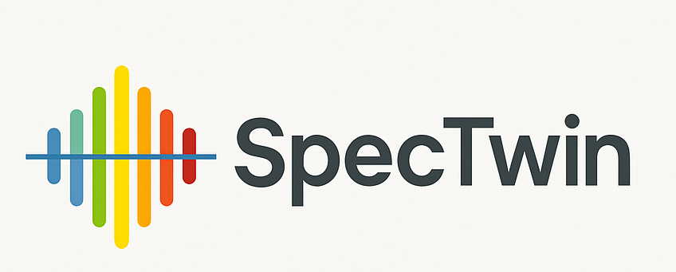

<p align="center">
  
</p>

# SpecTwin

SpecTwin is a modular Python application for X-ray emission spectroscopy workflows. It combines:

- **Digital Twin simulation** based on `xrt`
- **AutoFDMNES** workflows for material-aware spectral simulation
- **Data visualization and processing** tools
- **Subpixel/event analysis** utilities
- **Dear PyGui** based graphical interfaces

The repository is currently structured as a desktop application and is mainly intended for **Windows** use, especially because it includes an `fdmnes_win64.exe` executable.

---

## Video demos

The following videos show the main workflows currently implemented in SpecTwin:

### Digital Twin workflow
[](https://www.youtube.com/watch?v=hH9EX2Ia6WU)

Demonstration of the digital twin workflow for simulation-driven spectrometer setup and optimization.

### XES simulation workflow
[](https://www.youtube.com/watch?v=jMjhRHJ3Juo)

Demonstration of the XES simulation workflow implemented in the AutoFDMNES module.

## Repository structure

```text
SpecTwin/
├─ Source/
│  ├─ SpectwinMain.py          # Main application window
│  ├─ StartScreen.py           # Start screen / launcher
│  ├─ AutoFDMNES/              # FDMNES-based material simulation module
│  ├─ DigitalTwin/             # xrt-based digital twin module
│  ├─ DataVisualization/       # plotting and visualization tools
│  ├─ DataAlligning/           # data processing / alignment tools
│  ├─ MergeData/               # merge utilities
│  ├─ SubPixel/                # event/subpixel analysis tools
│  ├─ fonts/
│  └─ img/
└─ xrt_update/
   └─ screens.py               # patched xrt backend file
```

---

## Requirements

Recommended setup:

- **OS:** Windows 10/11
- **Python:** a clean virtual environment is strongly recommended
- **Git** for cloning the repository

Main Python dependencies used by the project include:

- `dearpygui`
- `numpy`
- `pandas`
- `scipy`
- `matplotlib`
- `plotly`
- `Pillow`
- `h5py`
- `silx`
- `scikit-optimize`
- `xraydb`
- `xrt`
- `mp-api`

---

## Installation

### 1. Clone the repository

```bash
git clone <your-gitlab-repo-url>
cd SpecTwin
```

### 2. Create and activate a virtual environment

#### Windows (PowerShell)

```powershell
python -m venv .venv
.\.venv\Scripts\Activate.ps1
```

#### Windows (cmd)

```cmd
python -m venv .venv
.venv\Scripts\activate
```

### 3. Install Python dependencies

You can install the packages manually:

```bash
pip install --upgrade pip
pip install -r requirements.txt
```

If you do not yet have a `requirements.txt`, use:

```bash
pip install dearpygui numpy pandas scipy matplotlib plotly pillow h5py silx scikit-optimize xraydb xrt mp-api
```

### 4. Patch `xrt` with the custom `screens.py`

After installing `xrt`, copy the patched file from this repository:

```text
xrt_update/screens.py
```

into your Python environment here:

```text
Lib\site-packages\xrt\backends\raycing\
```

So the final target file becomes:

```text
Lib\site-packages\xrt\backends\raycing\screens.py
```

This step is required because SpecTwin uses a customized version of `screens.py` for the digital twin workflow.

### 5. Check bundled resources

Make sure these folders remain next to the source code:

- `fonts/`
- `img/`
- `AutoFDMNES/fdmnes_Win64/`

The application expects these files at runtime.

---

## Running the application

From the `Source` folder:

```bash
cd Source
python StartScreen.py
```

Alternatively, to open the main application directly:

```bash
cd Source
python SpectwinMain.py
```

---

## Modules

### Start screen

`StartScreen.py` opens the landing page and launches the main application.

### Main control panel

`SpectwinMain.py` provides access to the core modules:

- **DigitalTwin**
- **VisualizeData**
- **ProcessData**
- **SubPixelResolution**
- **Merge .h5/.evt Files**
- **AutoFDMNES**

### AutoFDMNES

The `AutoFDMNES` module supports:

- material lookup
- CIF retrieval
- FDMNES input generation
- EXAFS/XES simulation setup
- output/job management

### Digital Twin

The digital twin module is built around `xrt` and is used for simulation-driven geometry and analyzer optimization.

---

## Notes on FDMNES

This repository includes Windows-specific FDMNES binaries under:

```text
Source/AutoFDMNES/fdmnes_Win64/
```

If you move the repository, keep this internal folder structure unchanged, otherwise file paths inside the application may break.

---

## Materials Project API

The AutoFDMNES module uses the Materials Project API for CIF retrieval.

Before publishing this repository publicly, check whether any API key is hard-coded in the source code and remove it if necessary. A safer approach is to read the key from an environment variable.

---

## Troubleshooting

### `Font file not found`
Run the application from the `Source` directory so that relative paths to `fonts/` and `img/` resolve correctly.

### `ModuleNotFoundError`
Make sure the virtual environment is activated and all packages are installed.

### `xrt` simulation errors
Verify that the patched `screens.py` was copied into:

```text
Lib\site-packages\xrt\backends\raycing\
```

### FDMNES does not run
Check that `fdmnes_win64.exe` exists in:

```text
Source/AutoFDMNES/fdmnes_Win64/
```

---

## Suggested next improvements for the repository

For a cleaner public GitLab repository, the following would be useful:

- add a pinned `requirements.txt`
- add a `.gitignore`
- move secrets/API keys out of source files
- document example input/output datasets
- add screenshots of the GUI

---

## Citation / acknowledgement

If you use this software in academic work, add the appropriate citation or acknowledgement information here.
